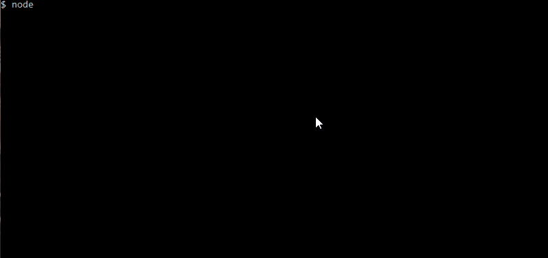

# Employe-Summary

:computer:

## Table of Content

- [Description](#description)
- [Development](#development)
- [Installation](#installation)
- [Dependencies](#dependencies)
- [Tests](#tests)
- [Built With](#built-with)
- [Questions](#questions)
- [Demo](#demo)
- [License](#license)
- [Acknowledgments](#acknowledgments)
- [CopyRight](#copyright)

## Description

This application generates a web page of a company or project team. The web page that is generated displays an the employee summary portal, which includes the following:

- Manager

- Engineer

- Intern

With important contact information as their name, employee id and their email address.

There are more information returned depending on their title and the information entered when running the application:

- Manager includes an office number

- Engineer includes a github name

- Intern includes a school name

The application builds a team with one manager and as many engineers and interns as you have.

## Development

This application was built using node.js and adding the required dependencies, as inquirer and fs

## Installation

To use this application:

- Clone the GitHub repository at: <https://github.com/johnnyboysydney/Employee-Summary/>

- All the packages are already included

- If you are missing a package, download it from terminal (Mac) or Bash command line (Windows), run ```npm install node```, ```npm install inquirer```, ```npm install fs``` & ```npm install color```

- The application itself runs from the command line, run "node app.js"

- You will be prompted to enter a manager and as many engineers and interns as you like

- Choose done when you have no more team members to enter

- The resulting html file appears in an output directory as output.html

- There is a style.css file included for basic initial stykling, Use your own design

### Dependencies

- FS
- Color
- Inquirer

## Tests

To run the tests type in the console ```npm run test```


### Built With

- [VScode](https://code.visualstudio.com/) - The editor of choice
- [Notepad++](https://notepad-plus-plus.org/) - My second editor
- [Gitbash](https://gitforwindows.org/) - What would we do without our bash?

### Questions

1. How can I run the application?  
You just need to run node index.js from your terminal console in the file directory

2. What if I get an error?  
Ensure that you have install all the dependencies required for this to work. See Dependencies section

3. Can I modify the CSS file?
Yes, you can modify the layout as you wish

4. What If I make a mistake during the input?
You can run the applicaiton again and it will overwrite the output.html file, or you can edit it manually

### Demo




### License

[GNU General Public License v3.0](./LICENSE)

### Authors

- **John Merchan**

### Acknowledgments

To my 2 sons, who give me the power I need to keep going.

***

#### Copyright

Copyright 2020 &copy; John Merchan

:australia:
